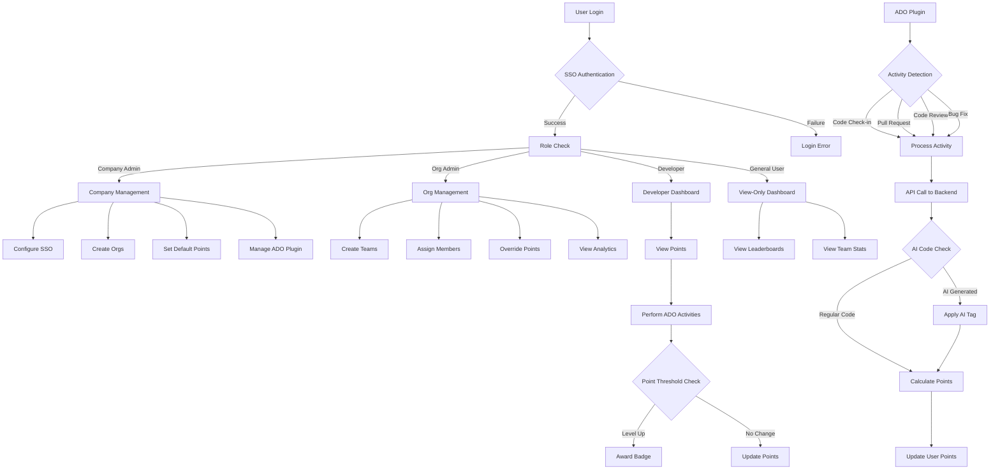
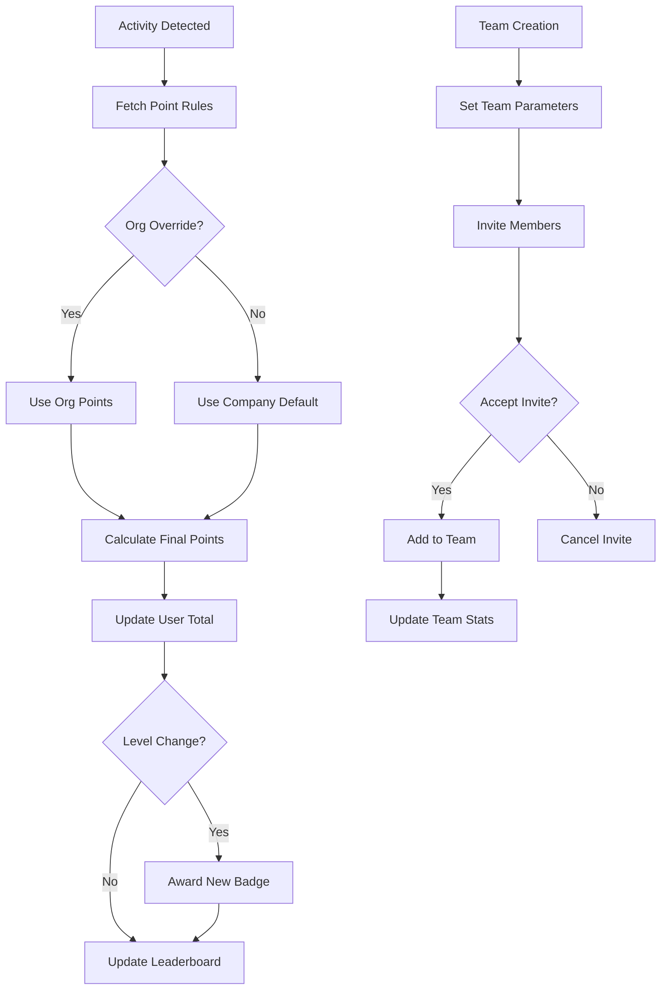
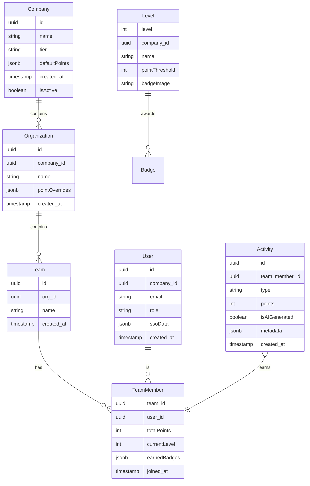
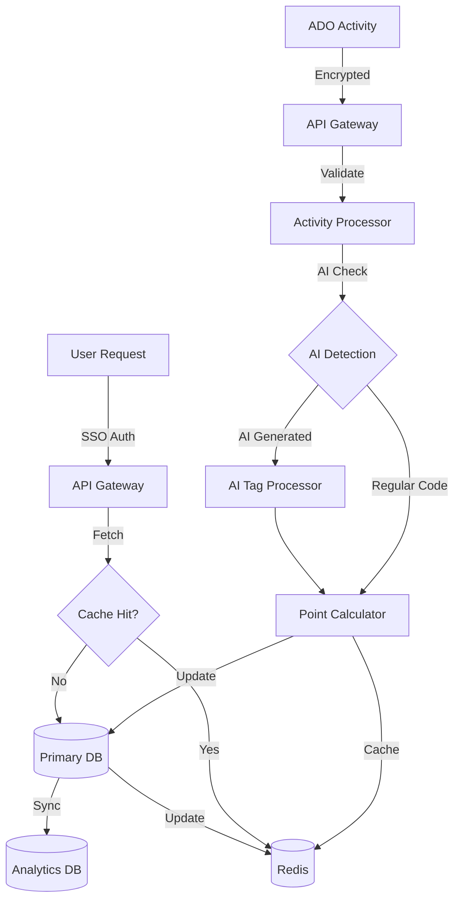
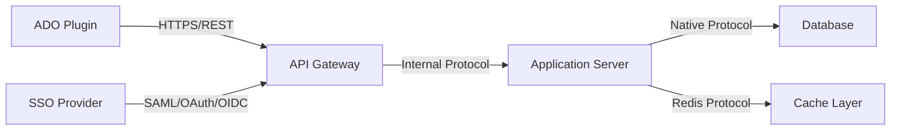

# Product Requirements Document (PRD)

# 1. INTRODUCTION

## 1.1 Purpose

This Software Requirements Specification (SRS) document provides a comprehensive description of the CodeQuest SAAS platform. It details the functional and non-functional requirements for developers, stakeholders, and project team members involved in the development and implementation of the system. This document serves as the primary reference for technical and non-technical audiences to understand the complete scope and specifications of the CodeQuest platform.

## 1.2 Scope

CodeQuest is a Software-as-a-Service (SAAS) gamification platform that integrates with Azure DevOps (ADO) to enhance developer engagement and productivity. The system encompasses:

- Multi-tenant architecture supporting thousands of companies
- Integration with Azure DevOps through a marketplace plugin
- Points-based reward system for development activities
- Hierarchical organization structure (Companies → Orgs → Teams → Members)
- Role-based access control system
- Real-time activity tracking and point allocation
- Achievement system with up to 20 levels and badges
- React-based user interfaces for administration and general use
- Node.js backend with REST API architecture
- SSO integration capabilities
- Comprehensive analytics and leaderboards

The platform will be offered in three tiers:
- Small: 1 Org, 10 Teams
- Medium: Up to 5 Orgs, 50 Teams total
- Enterprise: Up to 100 Orgs, 10,000 Teams

Key benefits include:
- Increased developer motivation through gamification
- Transparent recognition of contributions
- Enhanced team collaboration
- Measurable productivity metrics
- Customizable reward systems per organization
- Real-time performance tracking
- Cross-team performance visibility

# 2. PRODUCT DESCRIPTION

## 2.1 Product Perspective
CodeQuest operates as a standalone SAAS platform that integrates with Azure DevOps through a marketplace plugin. The system functions within the following context:

- Exists as a cloud-based service accessible via web browsers
- Interfaces with Azure DevOps through REST APIs for activity tracking
- Utilizes SSO providers for authentication
- Operates independently for each tenant company while sharing infrastructure
- Stores data in isolated multi-tenant database structures
- Scales horizontally across cloud infrastructure

## 2.2 Product Functions
The primary functions of CodeQuest include:

- Azure DevOps Activity Tracking
  - Code check-ins
  - Pull requests
  - Code reviews
  - Bug fixes
  - Story closures
  - Custom activity tracking

- Points and Rewards System
  - Real-time point allocation
  - 20-level achievement system
  - Badge awards
  - Team and individual leaderboards
  - Historical performance tracking

- Organization Management
  - Multi-tenant company administration
  - Org and team hierarchy management
  - Role-based access control
  - Point value configuration
  - Team member management

- Analytics and Reporting
  - Real-time dashboards
  - Cross-team comparisons
  - Performance trending
  - Activity metrics
  - Achievement tracking

## 2.3 User Characteristics

| User Type | Technical Expertise | Primary Responsibilities | Access Level |
|-----------|-------------------|------------------------|--------------|
| Super Admin | High | Platform maintenance, tenant management | Full system access |
| Company Admin | Medium-High | SSO setup, org creation, default point configuration | Company-wide access |
| Org Admin | Medium | Team management, point value customization | Organization-wide access |
| Developer | Medium-High | Software development, earning points | Team-level access |
| General User | Low-Medium | Viewing statistics and leaderboards | Read-only access |

## 2.4 Constraints

Technical Constraints:
- Must integrate exclusively with Azure DevOps
- Limited to 20 achievement levels per company
- Tier-based limitations on org and team counts
- Real-time processing requirements for point allocation
- Browser compatibility requirements for web interface

Business Constraints:
- Subscription tier limitations
- Compliance with data privacy regulations
- Azure Marketplace publication requirements
- SSO provider compatibility requirements

Resource Constraints:
- Infrastructure costs for multi-tenant scaling
- Development team size and capacity
- Time-to-market requirements
- Maintenance and support resources

## 2.5 Assumptions and Dependencies

Assumptions:
- Companies have active Azure DevOps implementations
- Users have basic web browser access
- Internet connectivity is consistently available
- Companies maintain SSO infrastructure
- Development activities are trackable through ADO APIs

Dependencies:
- Azure DevOps API availability and stability
- SSO provider services
- Cloud infrastructure availability
- Database scaling capabilities
- Browser compatibility with React applications
- Azure Marketplace approval process
- Third-party authentication services
- Network bandwidth for real-time updates

# 3. PROCESS FLOWCHART

# 4. FUNCTIONAL REQUIREMENTS

## 4.1 Authentication and Access Control

### ID: F001
### Description
SSO-based authentication system with role-based access control supporting multiple authentication providers.
### Priority
High
### Requirements

| Requirement ID | Description | Acceptance Criteria |
|---------------|-------------|-------------------|
| F001.1 | Support SAML, OAuth, and OpenID Connect SSO integration | - Successfully authenticate users through all supported protocols - Maintain session management - Handle token refresh |
| F001.2 | Role-based access control system | - Enforce Super Admin, Company Admin, Org Admin, Developer, and General User permissions - Restrict access based on role hierarchy |
| F001.3 | Multi-tenant user management | - Isolate user data between companies - Support user membership in multiple teams |

## 4.2 Azure DevOps Integration

### ID: F002
### Description
Marketplace plugin for Azure DevOps that tracks and reports development activities.
### Priority
High
### Requirements

| Requirement ID | Description | Acceptance Criteria |
|---------------|-------------|-------------------|
| F002.1 | ADO Plugin Installation | - Available on Azure Marketplace - Configurable through ADO interface |
| F002.2 | Activity Tracking | - Track code check-ins - Monitor pull requests - Log code reviews - Record bug fixes - Track story closures |
| F002.3 | Real-time Data Transmission | - Secure API communication - Near real-time point updates - Retry mechanism for failed transmissions |

## 4.3 Points and Rewards System

### ID: F003
### Description
Comprehensive point allocation and reward system with configurable rules and achievements.
### Priority
High
### Requirements

| Requirement ID | Description | Acceptance Criteria |
|---------------|-------------|-------------------|
| F003.1 | Point Configuration | - Company-wide default point values - Org-level point value overrides - Activity-based point allocation |
| F003.2 | Achievement System | - 20 distinct achievement levels - Custom badges per level - Point thresholds for level progression |
| F003.3 | AI Code Detection | - Identify AI-generated code - Apply special point rules for AI contributions - Tag AI-assisted activities |

## 4.4 Organization Management

### ID: F004
### Description
Hierarchical organization structure management with tiered limitations.
### Priority
High
### Requirements

| Requirement ID | Description | Acceptance Criteria |
|---------------|-------------|-------------------|
| F004.1 | Company Structure | - Support for multiple organizations - Team management within orgs - Member assignment to teams |
| F004.2 | Tier Management | - Small: 1 Org, 10 Teams - Medium: 5 Orgs, 50 Teams - Enterprise: 100 Orgs, 10,000 Teams |
| F004.3 | Admin Controls | - Company-wide settings management - Org-level configuration - Team setup and maintenance |

## 4.5 Analytics and Reporting

### ID: F005
### Description
Comprehensive analytics and reporting system for tracking performance and engagement.
### Priority
Medium
### Requirements

| Requirement ID | Description | Acceptance Criteria |
|---------------|-------------|-------------------|
| F005.1 | Leaderboards | - Team leaderboards - Individual rankings - Cross-team comparisons |
| F005.2 | Performance Metrics | - Historical point tracking - Activity trends - Achievement progress |
| F005.3 | Administrative Reports | - User engagement metrics - Team performance analytics - System usage statistics |

## 4.6 User Interface

### ID: F006
### Description
React-based interfaces for different user roles with specific functionality.
### Priority
High
### Requirements

| Requirement ID | Description | Acceptance Criteria |
|---------------|-------------|-------------------|
| F006.1 | Admin Interface | - Company configuration panel - Organization management tools - Point system configuration |
| F006.2 | Developer Dashboard | - Personal progress tracking - Achievement display - Activity history |
| F006.3 | General User Interface | - Leaderboard viewing - Team statistics - Achievement browsing |

# 5. NON-FUNCTIONAL REQUIREMENTS

## 5.1 Performance Requirements

| Requirement | Description | Target Metric |
|------------|-------------|---------------|
| Response Time | Maximum time for API responses | < 500ms for 95% of requests |
| Point Update Latency | Time from ADO activity to point reflection | < 2 seconds |
| Database Query Time | Maximum time for complex leaderboard queries | < 1 second |
| Concurrent Users | Supported simultaneous active users | 10,000 per instance |
| API Throughput | Maximum API calls handled per second | 1,000 requests/second |
| Resource Usage | Maximum server resource utilization | < 80% CPU, < 85% memory |

## 5.2 Safety Requirements

| Requirement | Description | Implementation |
|------------|-------------|----------------|
| Data Backup | Regular automated backups | Daily incremental, weekly full |
| Disaster Recovery | Recovery Point Objective (RPO) | < 1 hour data loss |
| System Recovery | Recovery Time Objective (RTO) | < 4 hours downtime |
| Failover | Automatic system failover capability | < 5 minutes switchover |
| Data Integrity | Consistency checks and validation | Real-time validation |
| Error Handling | Graceful degradation of services | Fallback mechanisms |

## 5.3 Security Requirements

| Requirement | Description | Implementation |
|------------|-------------|----------------|
| Authentication | Multi-factor authentication support | SSO + MFA integration |
| Authorization | Role-based access control | Granular permission system |
| Data Encryption | Encryption standards | AES-256 at rest, TLS 1.3 in transit |
| API Security | API access control | OAuth 2.0 + JWT tokens |
| Audit Logging | Security event tracking | Complete audit trail |
| Data Isolation | Multi-tenant data separation | Logical tenant separation |

## 5.4 Quality Requirements

### 5.4.1 Availability
- System uptime: 99.9% excluding planned maintenance
- Planned maintenance windows: Maximum 4 hours monthly
- Service degradation notification: < 15 minutes

### 5.4.2 Maintainability
- Code coverage: Minimum 80%
- Documentation: Complete API documentation
- Deployment automation: CI/CD pipeline with rollback capability
- Module coupling: Low coupling, high cohesion architecture

### 5.4.3 Usability
- Browser compatibility: Latest versions of Chrome, Firefox, Safari, Edge
- Mobile responsiveness: All interfaces adapt to mobile devices
- Accessibility: WCAG 2.1 Level AA compliance
- Error messages: Clear, actionable user feedback

### 5.4.4 Scalability
- Horizontal scaling: Support for multiple application instances
- Database scaling: Automatic sharding capability
- Load balancing: Automatic distribution across instances
- Cache scaling: Distributed caching system

### 5.4.5 Reliability
- Mean Time Between Failures (MTBF): > 720 hours
- Mean Time To Recovery (MTTR): < 1 hour
- Error rate: < 0.1% of all transactions
- Data consistency: Eventually consistent within 2 seconds

## 5.5 Compliance Requirements

| Requirement | Description | Implementation |
|------------|-------------|----------------|
| Data Privacy | GDPR compliance | Data protection measures |
| Data Retention | Configurable retention policies | Automated data lifecycle |
| Azure Marketplace | Marketplace technical requirements | Compliance with Microsoft standards |
| API Standards | REST API best practices | OpenAPI 3.0 specification |
| SSO Standards | Identity provider compliance | SAML 2.0, OAuth 2.0, OpenID Connect |
| Security Standards | Industry security standards | OWASP Top 10 compliance |

# 6. DATA REQUIREMENTS

## 6.1 Data Models

## 6.2 Data Storage

### 6.2.1 Storage Requirements

| Data Type | Storage Method | Retention Period | Backup Frequency |
|-----------|---------------|------------------|------------------|
| User Data | Primary Database | Lifetime of account | Daily |
| Activity History | Time-series Database | 12 months | Daily |
| Points/Badges | Primary Database | Lifetime of account | Daily |
| Audit Logs | Log Storage | 24 months | Weekly |
| Analytics Data | Data Warehouse | 36 months | Weekly |

### 6.2.2 Database Architecture
- Primary Database: PostgreSQL with tenant isolation
- Time-series Database: TimescaleDB for activity tracking
- Cache Layer: Redis for real-time leaderboards
- Analytics: ClickHouse for complex analytics queries

### 6.2.3 Backup and Recovery
- Daily incremental backups
- Weekly full backups
- Point-in-time recovery capability
- Cross-region backup replication
- 30-day backup retention
- Recovery time objective (RTO): 4 hours
- Recovery point objective (RPO): 1 hour

## 6.3 Data Processing

### 6.3.1 Data Security

| Layer | Security Measure | Implementation |
|-------|-----------------|----------------|
| Transport | TLS 1.3 | All API communications |
| Storage | AES-256 | Database encryption at rest |
| Application | Row-level Security | Tenant isolation |
| Cache | Encrypted Redis | In-memory data protection |
| Backup | Encrypted backups | All backup storage |

### 6.3.2 Data Processing Requirements

- Real-time activity processing: < 2 seconds
- Point calculation latency: < 500ms
- Leaderboard updates: Near real-time
- Analytics processing: Batch (hourly)
- Cache refresh: Every 5 minutes
- Data consistency: Eventually consistent

### 6.3.3 Data Validation

- Input validation on all API endpoints
- Schema validation for database operations
- Data type enforcement
- Cross-tenant data access prevention
- Duplicate activity detection
- Point calculation verification

# 7. EXTERNAL INTERFACES

## 7.1 User Interfaces

### 7.1.1 Admin Interface

| Component | Description | Requirements |
|-----------|-------------|--------------|
| Company Dashboard | Primary admin control panel | - SSO configuration panel - Organization management - Point system configuration - ADO plugin setup |
| Organization Management | Org-level control interface | - Team creation/management - Point override controls - Member assignment tools |
| Analytics Dashboard | Data visualization interface | - Real-time metrics display - Configurable charts - Export capabilities |

### 7.1.2 Developer Interface

| Component | Description | Requirements |
|-----------|-------------|--------------|
| Personal Dashboard | Individual progress tracking | - Current points display - Achievement progress - Badge showcase |
| Team View | Team-based statistics | - Team leaderboard - Activity feed - Team achievements |
| Activity History | Personal activity tracking | - Historical point logs - Activity breakdown - AI contribution tags |

### 7.1.3 General User Interface

| Component | Description | Requirements |
|-----------|-------------|--------------|
| Leaderboard View | Read-only statistics display | - Global rankings - Team comparisons - Achievement showcase |
| Team Browser | Team exploration interface | - Search functionality - Filter controls - Sort options |

### 7.1.4 Technical Requirements

- React-based responsive design
- Support for latest versions of Chrome, Firefox, Safari, and Edge
- WCAG 2.1 Level AA compliance
- Mobile-first approach for all interfaces
- Maximum page load time of 2 seconds
- Offline capability for critical views

## 7.2 Software Interfaces

### 7.2.1 Azure DevOps Integration

| Interface | Specification | Protocol |
|-----------|--------------|----------|
| Activity Tracking | Azure DevOps REST API v6.0+ | HTTPS/REST |
| Authentication | OAuth 2.0 | HTTPS |
| Webhook Events | Azure DevOps Service Hooks | HTTPS/Webhook |

### 7.2.2 SSO Provider Interfaces

| Provider Type | Protocol | Requirements |
|--------------|----------|--------------|
| SAML 2.0 | HTTPS/SAML | - XML-based assertions - Certificate management - Metadata exchange |
| OAuth 2.0 | HTTPS/OAuth | - Token management - Scope configuration - Refresh token handling |
| OpenID Connect | HTTPS/OIDC | - JWT support - Discovery endpoint - User info endpoint |

### 7.2.3 Database Interfaces

| System | Interface Type | Requirements |
|--------|---------------|--------------|
| PostgreSQL | Native Driver | - Connection pooling - Prepared statements - Transaction management |
| Redis Cache | Redis Client | - Cluster support - Pub/Sub capabilities - Key expiration |
| TimescaleDB | SQL Interface | - Time-series optimization - Continuous aggregates - Retention policies |

## 7.3 Communication Interfaces

### 7.3.1 API Specifications

| Interface | Protocol | Format |
|-----------|----------|--------|
| REST API | HTTPS | JSON |
| WebSocket | WSS | JSON |
| Event Stream | Server-Sent Events | JSON |

### 7.3.2 Network Requirements

| Requirement | Specification |
|-------------|---------------|
| Bandwidth | Minimum 1 Mbps per user |
| Latency | Maximum 100ms RTT |
| Protocol | TLS 1.3 |
| Port | 443 (HTTPS) |
| WebSocket | Port 443 (WSS) |

### 7.3.3 Integration Protocols

### 7.3.4 Data Exchange Formats

| Component | Format | Validation |
|-----------|--------|------------|
| API Requests | JSON | JSON Schema |
| API Responses | JSON | OpenAPI 3.0 |
| Event Streams | JSON | JSON Schema |
| Batch Data | JSONL | Schema Validation |
| Metrics | Prometheus | Metric Types |

# 8. APPENDICES

## 8.1 GLOSSARY

| Term | Definition |
|------|------------|
| Achievement | A milestone reached by accumulating a specific number of points |
| Badge | A visual representation awarded for reaching specific achievement levels |
| Level | One of 20 possible tiers that users can attain through point accumulation |
| Organization (Org) | A subdivision within a company that can contain multiple teams |
| Point Override | The ability for Org Admins to customize point values differently from company defaults |
| Team Member | A developer who belongs to one or more teams and can earn points |
| Tenant | A single company instance within the multi-tenant architecture |
| Tier | Subscription level (Small, Medium, Enterprise) determining org and team limits |

## 8.2 ACRONYMS

| Acronym | Expansion |
|---------|-----------|
| ADO | Azure DevOps |
| API | Application Programming Interface |
| CI/CD | Continuous Integration/Continuous Deployment |
| GDPR | General Data Protection Regulation |
| JWT | JSON Web Token |
| MFA | Multi-Factor Authentication |
| MTBF | Mean Time Between Failures |
| MTTR | Mean Time To Recovery |
| OIDC | OpenID Connect |
| PR | Pull Request |
| REST | Representational State Transfer |
| RPO | Recovery Point Objective |
| RTO | Recovery Time Objective |
| SAAS | Software as a Service |
| SAML | Security Assertion Markup Language |
| SSO | Single Sign-On |
| TLS | Transport Layer Security |
| UI | User Interface |
| UUID | Universally Unique Identifier |
| WCAG | Web Content Accessibility Guidelines |
| WSS | WebSocket Secure |

## 8.3 ADDITIONAL REFERENCES

| Reference | Description | URL |
|-----------|-------------|-----|
| Azure DevOps REST API | Official API documentation for ADO integration | https://docs.microsoft.com/en-us/rest/api/azure/devops |
| React Documentation | Official React framework documentation | https://reactjs.org/docs |
| Node.js Best Practices | Node.js security and performance guidelines | https://nodejs.org/en/docs/guides |
| OAuth 2.0 Specification | Authentication protocol specification | https://oauth.net/2/ |
| SAML 2.0 Standard | SSO protocol documentation | https://docs.oasis-open.org/security/saml/v2.0/saml-core-2.0-os.pdf |
| PostgreSQL Documentation | Database implementation guidelines | https://www.postgresql.org/docs/ |
| Redis Documentation | Caching system implementation | https://redis.io/documentation |
| Azure Marketplace | Publishing guidelines for ADO plugins | https://docs.microsoft.com/en-us/azure/marketplace/marketplace-publishing-guide |