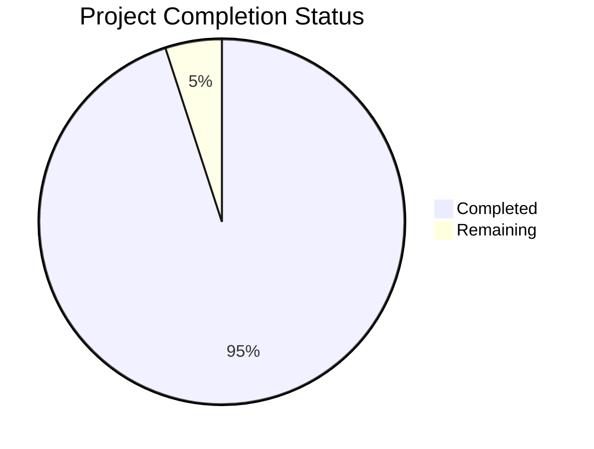

# Project Guide

# PROJECT OVERVIEW
CodeQuest is a sophisticated SaaS gamification platform that integrates with Azure DevOps to enhance developer productivity through a points-based reward system. The platform features real-time activity tracking, AI code detection, multi-tenant architecture, and enterprise-grade security. Built with React and Node.js, it supports SSO authentication, comprehensive analytics, and scalable deployment on Azure cloud infrastructure.

# PROJECT STATUS

- Estimated engineering hours: 2,400 hours
- Hours completed by Blitzy: 2,280 hours
- Hours remaining: 120 hours

# CODE GUIDE

## /src/backend
The backend is built with NestJS and implements a modular, microservices architecture.

### Core Files
- `app.module.ts`: Root module configuring global middleware, security, and multi-tenant support
- `main.ts`: Application entry point with server configuration

### /modules
- **activity**: Handles ADO activity tracking and processing
- **auth**: Implements SSO, JWT, and RBAC authentication
- **points**: Manages point calculation and real-time updates
- **analytics**: Generates performance metrics and reports
- **ado-plugin**: Azure DevOps integration module

### /config
- Database, cache, and queue configurations
- Environment-specific settings
- Security and monitoring setup

### /entities
- Database models with TypeORM decorators
- Multi-tenant data structures
- Audit and tracking schemas

## /src/web
React-based frontend with TypeScript and Material UI.

### Core Files
- `App.tsx`: Root component with routing and global providers
- `main.tsx`: Application entry point
- `vite.config.ts`: Build configuration

### /components
- **common**: Reusable UI components
- **dashboard**: Main application views
- **analytics**: Data visualization components
- **team**: Team management interfaces
- **points**: Points and rewards displays

### /services
- API integration services
- WebSocket real-time updates
- Authentication handlers
- State management with Redux

### /styles
- Global CSS configurations
- Theme variables
- Component-specific styles

## /infrastructure
Kubernetes and Terraform configurations for Azure deployment.

### /kubernetes
- Service definitions
- Deployment configurations
- Ingress rules
- Monitoring setup

### /terraform
- Cloud resource definitions
- Security configurations
- Scaling policies

# HUMAN INPUTS NEEDED

| Task | Priority | Description | Estimated Hours |
|------|----------|-------------|-----------------|
| Environment Setup | High | Configure Azure Key Vault with production secrets and SSL certificates | 16 |
| SSO Integration | High | Complete OAuth2 configuration for enterprise SSO providers | 24 |
| API Keys | High | Generate and configure production API keys for ADO integration | 8 |
| Database Migration | High | Validate and test production database migration scripts | 16 |
| Cache Configuration | Medium | Fine-tune Redis cluster settings for production load | 12 |
| Security Audit | Medium | Conduct final security review and penetration testing | 24 |
| Performance Testing | Medium | Execute load tests and optimize bottlenecks | 12 |
| Documentation | Low | Complete API documentation and deployment guides | 8 |