# Technical Specifications

# 1. INTRODUCTION

## 1.1 EXECUTIVE SUMMARY

CodeQuest is a Software-as-a-Service (SaaS) gamification platform that integrates with Azure DevOps (ADO) to enhance developer productivity and engagement through a points-based reward system. The platform addresses the challenge of maintaining developer motivation and recognizing contributions by automatically tracking and rewarding development activities within ADO.

The system serves multiple stakeholders including company administrators, organization managers, developers, and general users, providing a scalable solution that can support from small development teams to enterprise-scale organizations with thousands of users. By gamifying the development process, CodeQuest aims to increase developer satisfaction, improve code quality, and provide measurable metrics for team performance.

## 1.2 SYSTEM OVERVIEW

### Project Context

| Aspect | Description |
|--------|-------------|
| Business Context | First-to-market gamification platform specifically for Azure DevOps |
| Market Position | Enterprise SaaS solution for development team engagement |
| Target Market | Companies using Azure DevOps for development |
| Integration Landscape | Azure DevOps, SSO Providers, Enterprise Authentication Systems |

### High-Level Description

| Component | Implementation |
|-----------|---------------|
| Frontend | React-based responsive web applications |
| Backend | Node.js REST API architecture |
| Database | Multi-tenant data storage with PostgreSQL |
| Integration | Azure DevOps Marketplace plugin |
| Authentication | Enterprise SSO support (SAML, OAuth, OpenID Connect) |
| Scalability | Horizontally scalable to support 10,000+ companies |

### Success Criteria

| Metric | Target |
|--------|--------|
| System Uptime | 99.9% |
| Response Time | < 500ms for 95% of requests |
| User Adoption | > 80% of team members actively earning points |
| Activity Processing | Real-time updates within 2 seconds |
| Customer Satisfaction | > 90% positive feedback |

## 1.3 SCOPE

### In-Scope Features

| Category | Components |
|----------|------------|
| Core Platform | - Multi-tenant architecture<br>- Role-based access control<br>- Points and rewards system<br>- Real-time leaderboards |
| ADO Integration | - Activity tracking<br>- Point allocation<br>- AI code detection<br>- Performance metrics |
| User Management | - SSO integration<br>- Team hierarchy<br>- Role management<br>- Points administration |
| Analytics | - Performance dashboards<br>- Team comparisons<br>- Historical trending<br>- Achievement tracking |

### Implementation Boundaries

| Boundary Type | Coverage |
|--------------|----------|
| User Groups | - Company Admins<br>- Org Admins<br>- Developers<br>- General Users |
| System Tiers | - Small (1 Org, 10 Teams)<br>- Medium (5 Orgs, 50 Teams)<br>- Enterprise (100 Orgs, 10,000 Teams) |
| Geographic Scope | Global deployment with multi-region support |
| Data Coverage | 12 months of historical activity data |

### Out-of-Scope Elements

- Mobile applications (future phase)
- Integration with non-Azure DevOps platforms
- Custom gamification rule engines
- Real-time chat or collaboration features
- Direct monetary reward systems
- Integration with HR systems
- Custom badge design tools
- Public API for third-party integrations
- Offline mode functionality
- Advanced AI code analysis beyond basic detection

# 2. SYSTEM ARCHITECTURE

## 2.1 High-Level Architecture

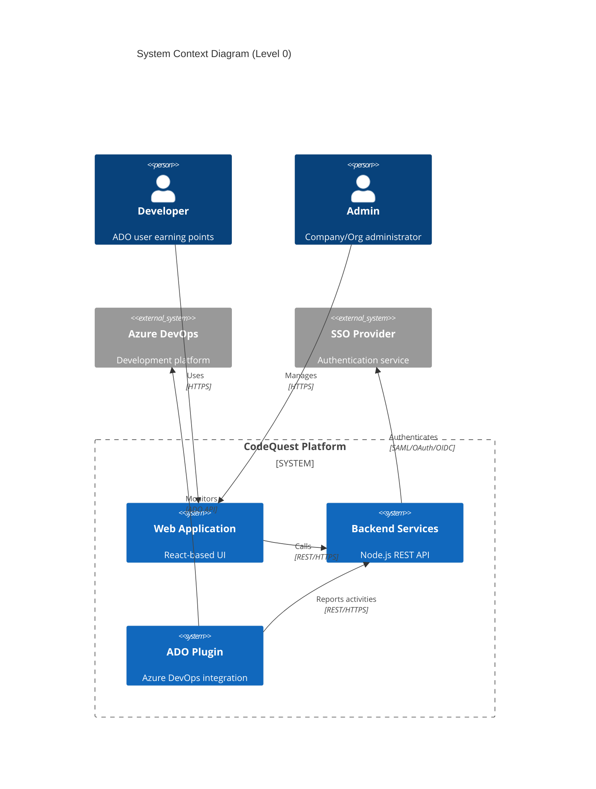
```mermaid
C4Context
    title System Context Diagram (Level 0)
    
    Person(dev, "Developer", "ADO user earning points")
    Person(admin, "Admin", "Company/Org administrator")
    
    System_Boundary(codequest, "CodeQuest Platform") {
        System(web, "Web Application", "React-based UI")
        System(api, "Backend Services", "Node.js REST API")
        System(plugin, "ADO Plugin", "Azure DevOps integration")
    }
    
    System_Ext(ado, "Azure DevOps", "Development platform")
    System_Ext(sso, "SSO Provider", "Authentication service")
    
    Rel(dev, web, "Uses", "HTTPS")
    Rel(admin, web, "Manages", "HTTPS")
    Rel(web, api, "Calls", "REST/HTTPS")
    Rel(plugin, api, "Reports activities", "REST/HTTPS")
    Rel(plugin, ado, "Monitors", "ADO API")
    Rel(api, sso, "Authenticates", "SAML/OAuth/OIDC")
```

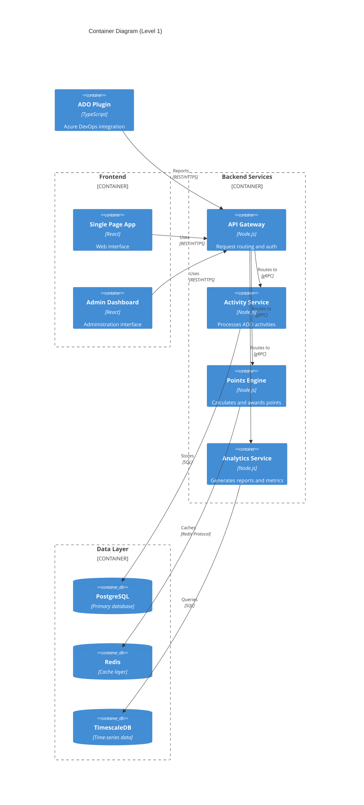
```mermaid
C4Container
    title Container Diagram (Level 1)
    
    Container_Boundary(frontend, "Frontend") {
        Container(spa, "Single Page App", "React", "Web interface")
        Container(adminui, "Admin Dashboard", "React", "Administration interface")
    }
    
    Container_Boundary(backend, "Backend Services") {
        Container(api_gateway, "API Gateway", "Node.js", "Request routing and auth")
        Container(activity, "Activity Service", "Node.js", "Processes ADO activities")
        Container(points, "Points Engine", "Node.js", "Calculates and awards points")
        Container(analytics, "Analytics Service", "Node.js", "Generates reports and metrics")
    }
    
    Container_Boundary(storage, "Data Layer") {
        ContainerDb(postgres, "PostgreSQL", "Primary database")
        ContainerDb(redis, "Redis", "Cache layer")
        ContainerDb(timescale, "TimescaleDB", "Time-series data")
    }
    
    Container(ado_plugin, "ADO Plugin", "TypeScript", "Azure DevOps integration")
    
    Rel(spa, api_gateway, "Uses", "REST/HTTPS")
    Rel(adminui, api_gateway, "Uses", "REST/HTTPS")
    Rel(ado_plugin, api_gateway, "Reports", "REST/HTTPS")
    
    Rel(api_gateway, activity, "Routes to", "gRPC")
    Rel(api_gateway, points, "Routes to", "gRPC")
    Rel(api_gateway, analytics, "Routes to", "gRPC")
    
    Rel(activity, postgres, "Stores", "SQL")
    Rel(points, redis, "Caches", "Redis Protocol")
    Rel(analytics, timescale, "Queries", "SQL")
```

## 2.2 Component Details

### 2.2.1 Frontend Components

| Component | Technology | Purpose | Scaling Strategy |
|-----------|------------|---------|------------------|
| Single Page App | React, TypeScript | User interface for developers and viewers | CDN distribution |
| Admin Dashboard | React, TypeScript | Configuration and management interface | CDN distribution |
| API Client | Axios, TypeScript | Communication with backend services | Client-side caching |

### 2.2.2 Backend Services

| Service | Technology | Responsibility | Scaling Approach |
|---------|------------|----------------|------------------|
| API Gateway | Node.js, Express | Request routing, authentication | Horizontal pod scaling |
| Activity Service | Node.js, TypeScript | Process ADO events | Event-driven scaling |
| Points Engine | Node.js, TypeScript | Calculate and award points | Queue-based scaling |
| Analytics Service | Node.js, TypeScript | Generate reports and metrics | Resource-based scaling |

### 2.2.3 Data Storage

| Store | Technology | Purpose | Scaling Strategy |
|-------|------------|---------|------------------|
| Primary Database | PostgreSQL 14+ | Tenant and user data | Vertical + Read replicas |
| Cache Layer | Redis Cluster | Real-time data and leaderboards | Horizontal sharding |
| Time-series DB | TimescaleDB | Activity history and metrics | Automatic partitioning |

## 2.3 Technical Decisions

### 2.3.1 Architecture Style

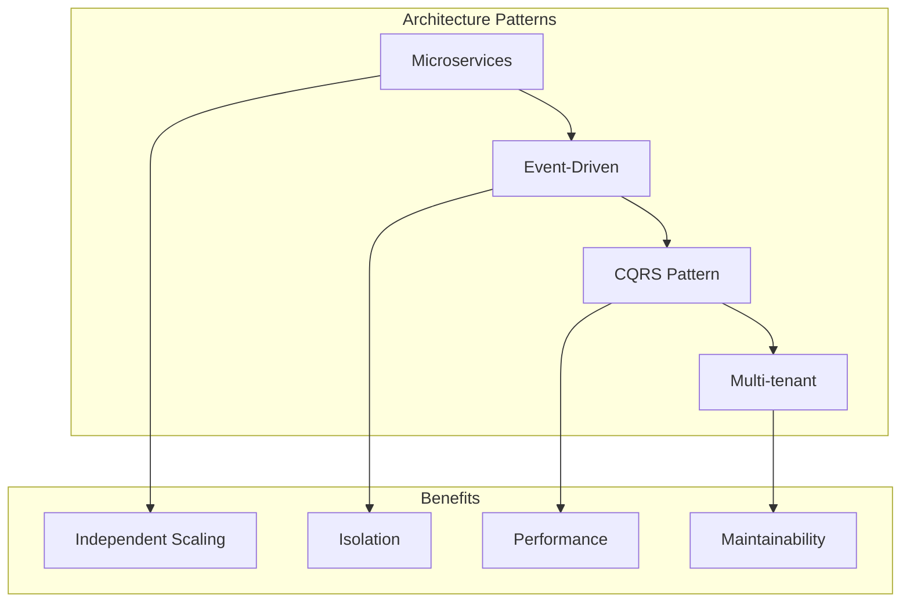
```mermaid
flowchart TD
    subgraph "Architecture Patterns"
        A[Microservices] --> B[Event-Driven]
        B --> C[CQRS Pattern]
        C --> D[Multi-tenant]
    end
    
    subgraph "Benefits"
        E[Independent Scaling]
        F[Isolation]
        G[Performance]
        H[Maintainability]
    end
    
    A --> E
    B --> F
    C --> G
    D --> H
```

### 2.3.2 Communication Patterns

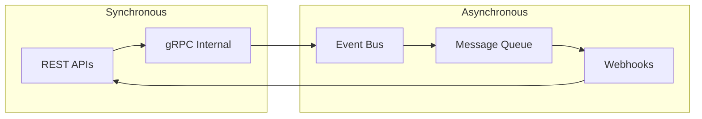
```mermaid
flowchart LR
    subgraph "Synchronous"
        A[REST APIs] --> B[gRPC Internal]
    end
    
    subgraph "Asynchronous"
        C[Event Bus] --> D[Message Queue]
        D --> E[Webhooks]
    end
    
    B --> C
    E --> A
```

## 2.4 Cross-Cutting Concerns

### 2.4.1 Monitoring and Security

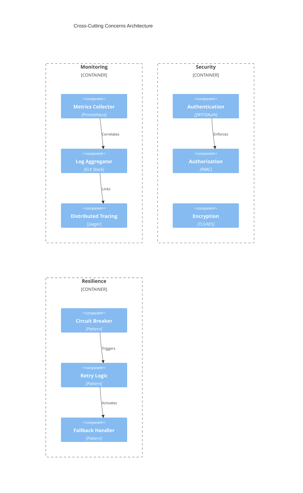
```mermaid
C4Component
    title Cross-Cutting Concerns Architecture
    
    Container_Boundary(monitoring, "Monitoring") {
        Component(metrics, "Metrics Collector", "Prometheus")
        Component(logs, "Log Aggregator", "ELK Stack")
        Component(trace, "Distributed Tracing", "Jaeger")
    }
    
    Container_Boundary(security, "Security") {
        Component(auth, "Authentication", "JWT/OAuth")
        Component(rbac, "Authorization", "RBAC")
        Component(encrypt, "Encryption", "TLS/AES")
    }
    
    Container_Boundary(resilience, "Resilience") {
        Component(circuit, "Circuit Breaker", "Pattern")
        Component(retry, "Retry Logic", "Pattern")
        Component(fallback, "Fallback Handler", "Pattern")
    }
    
    Rel(metrics, logs, "Correlates")
    Rel(logs, trace, "Links")
    Rel(auth, rbac, "Enforces")
    Rel(circuit, retry, "Triggers")
    Rel(retry, fallback, "Activates")
```

## 2.5 Deployment Architecture

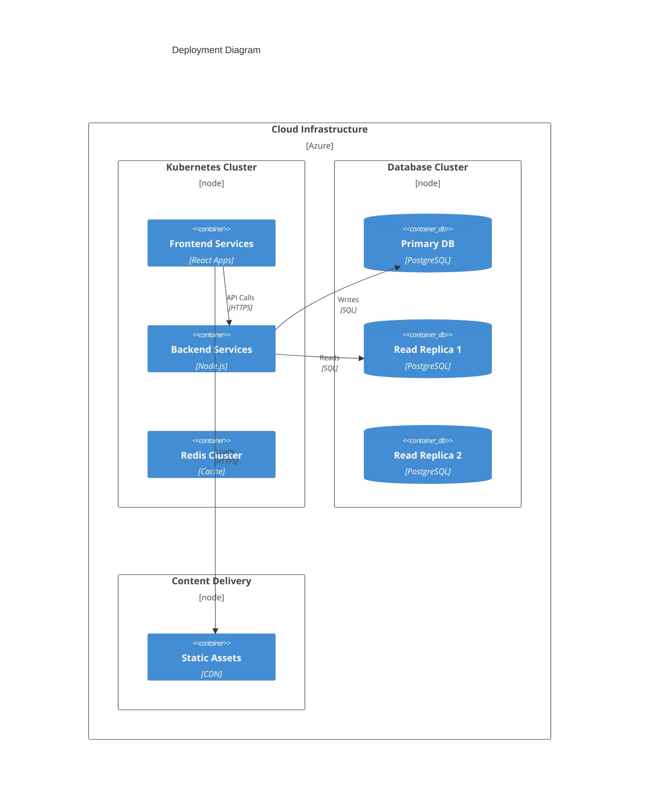
```mermaid
C4Deployment
    title Deployment Diagram
    
    Deployment_Node(cloud, "Cloud Infrastructure", "Azure") {
        Deployment_Node(k8s, "Kubernetes Cluster") {
            Container(frontend, "Frontend Services", "React Apps")
            Container(backend, "Backend Services", "Node.js")
            Container(cache, "Redis Cluster", "Cache")
        }
        
        Deployment_Node(db, "Database Cluster") {
            ContainerDb(primary, "Primary DB", "PostgreSQL")
            ContainerDb(replica1, "Read Replica 1", "PostgreSQL")
            ContainerDb(replica2, "Read Replica 2", "PostgreSQL")
        }
        
        Deployment_Node(cdn, "Content Delivery") {
            Container(assets, "Static Assets", "CDN")
        }
    }
    
    Rel(frontend, backend, "API Calls", "HTTPS")
    Rel(backend, primary, "Writes", "SQL")
    Rel(backend, replica1, "Reads", "SQL")
    Rel(frontend, assets, "Loads", "HTTPS")
```

# 3. SYSTEM COMPONENTS ARCHITECTURE

## 3.1 USER INTERFACE DESIGN

### 3.1.1 Design System Specifications

| Component | Specification | Implementation Details |
|-----------|--------------|----------------------|
| Typography | System fonts | - Primary: Inter<br>- Secondary: SF Pro<br>- Monospace: JetBrains Mono |
| Color Palette | Material Design 3 | - Primary: #1976D2<br>- Secondary: #424242<br>- Error: #D32F2F |
| Spacing System | 8px base unit | Increments: 8, 16, 24, 32, 48, 64px |
| Breakpoints | Material Design | - Mobile: 0-599px<br>- Tablet: 600-1239px<br>- Desktop: 1240px+ |
| Accessibility | WCAG 2.1 AA | - Contrast ratio: 4.5:1<br>- Focus indicators<br>- ARIA labels |

### 3.1.2 Interface Components

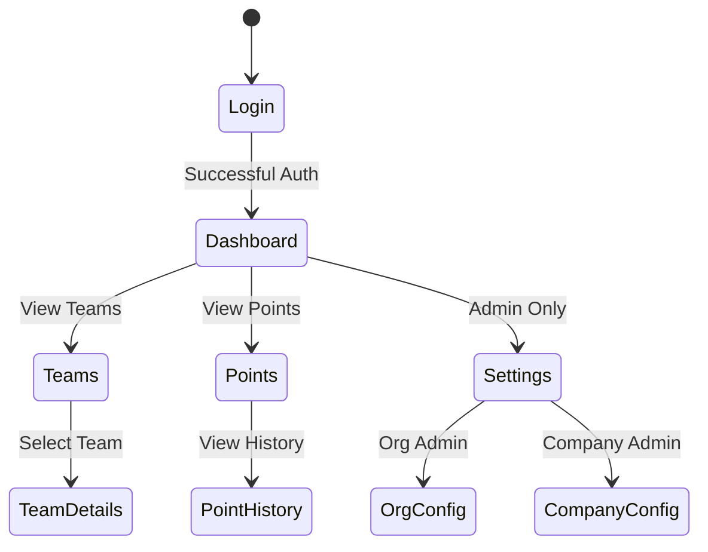
```mermaid
stateDiagram-v2
    [*] --> Login
    Login --> Dashboard: Successful Auth
    Dashboard --> Teams: View Teams
    Dashboard --> Points: View Points
    Dashboard --> Settings: Admin Only
    Teams --> TeamDetails: Select Team
    Points --> PointHistory: View History
    Settings --> OrgConfig: Org Admin
    Settings --> CompanyConfig: Company Admin
```

### 3.1.3 Critical User Flows

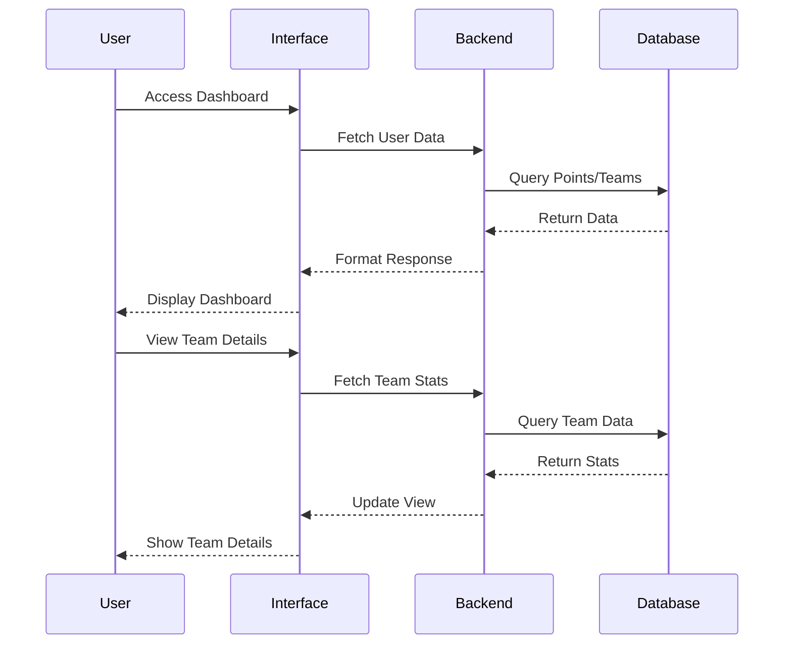
```mermaid
sequenceDiagram
    participant U as User
    participant UI as Interface
    participant API as Backend
    participant DB as Database

    U->>UI: Access Dashboard
    UI->>API: Fetch User Data
    API->>DB: Query Points/Teams
    DB-->>API: Return Data
    API-->>UI: Format Response
    UI-->>U: Display Dashboard
    
    U->>UI: View Team Details
    UI->>API: Fetch Team Stats
    API->>DB: Query Team Data
    DB-->>API: Return Stats
    API-->>UI: Update View
    UI-->>U: Show Team Details
```

## 3.2 DATABASE DESIGN

### 3.2.1 Schema Design

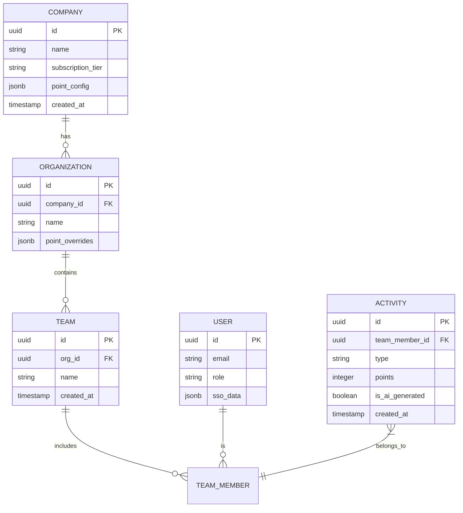
```mermaid
erDiagram
    COMPANY ||--o{ ORGANIZATION : has
    COMPANY {
        uuid id PK
        string name
        string subscription_tier
        jsonb point_config
        timestamp created_at
    }
    ORGANIZATION ||--o{ TEAM : contains
    ORGANIZATION {
        uuid id PK
        uuid company_id FK
        string name
        jsonb point_overrides
    }
    TEAM ||--o{ TEAM_MEMBER : includes
    TEAM {
        uuid id PK
        uuid org_id FK
        string name
        timestamp created_at
    }
    USER ||--o{ TEAM_MEMBER : is
    USER {
        uuid id PK
        string email
        string role
        jsonb sso_data
    }
    ACTIVITY }|--|| TEAM_MEMBER : belongs_to
    ACTIVITY {
        uuid id PK
        uuid team_member_id FK
        string type
        integer points
        boolean is_ai_generated
        timestamp created_at
    }
```

### 3.2.2 Data Management Strategy

| Aspect | Strategy | Implementation |
|--------|----------|----------------|
| Partitioning | Time-based | Monthly partitions for activity data |
| Indexing | Selective | Covering indexes for frequent queries |
| Caching | Multi-level | Redis L1, PostgreSQL JSONB L2 |
| Backup | Continuous | WAL archiving with point-in-time recovery |
| Retention | Tiered | Hot: 3 months, Warm: 1 year, Cold: 3 years |

## 3.3 API DESIGN

### 3.3.1 API Architecture

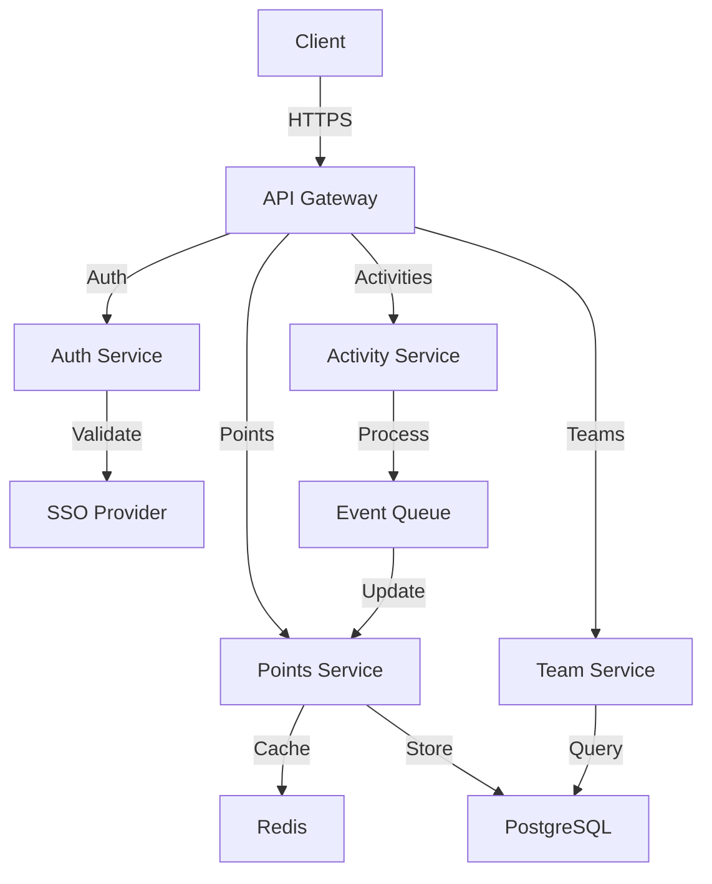
```mermaid
graph TD
    A[Client] -->|HTTPS| B[API Gateway]
    B -->|Auth| C[Auth Service]
    B -->|Points| D[Points Service]
    B -->|Teams| E[Team Service]
    B -->|Activities| F[Activity Service]
    
    C -->|Validate| G[SSO Provider]
    D -->|Cache| H[Redis]
    D -->|Store| I[PostgreSQL]
    E -->|Query| I
    F -->|Process| J[Event Queue]
    J -->|Update| D
```

### 3.3.2 Endpoint Specifications

| Endpoint | Method | Purpose | Auth Level |
|----------|--------|---------|------------|
| `/api/v1/activities` | POST | Record ADO activity | Plugin |
| `/api/v1/points` | GET | Retrieve user points | User |
| `/api/v1/teams` | GET | List teams | User |
| `/api/v1/admin/config` | PUT | Update settings | Admin |

### 3.3.3 Integration Patterns

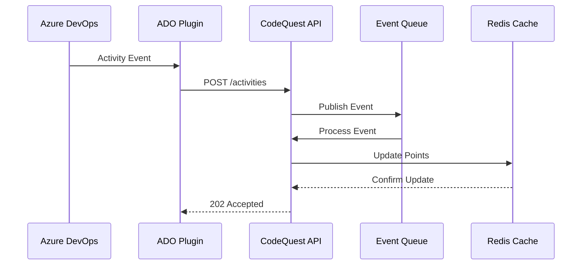
```mermaid
sequenceDiagram
    participant ADO as Azure DevOps
    participant Plugin as ADO Plugin
    participant API as CodeQuest API
    participant Queue as Event Queue
    participant Cache as Redis Cache

    ADO->>Plugin: Activity Event
    Plugin->>API: POST /activities
    API->>Queue: Publish Event
    Queue->>API: Process Event
    API->>Cache: Update Points
    Cache-->>API: Confirm Update
    API-->>Plugin: 202 Accepted
```

### 3.3.4 Security Controls

| Control | Implementation | Purpose |
|---------|----------------|---------|
| Authentication | JWT + OAuth2 | Identity verification |
| Authorization | RBAC | Access control |
| Rate Limiting | Token bucket | API protection |
| Input Validation | JSON Schema | Request validation |
| Output Encoding | Content-Type | Response security |
| SSL/TLS | v1.3 only | Transport security |

# 4. TECHNOLOGY STACK

## 4.1 PROGRAMMING LANGUAGES

| Platform/Component | Language | Version | Justification |
|-------------------|----------|---------|---------------|
| Backend Services | Node.js | 18 LTS | - Native async/await support<br>- Extensive ADO SDK support<br>- High performance for real-time operations |
| Frontend Applications | TypeScript | 5.0+ | - Type safety for large React applications<br>- Enhanced IDE support<br>- Better maintainability |
| ADO Plugin | TypeScript | 5.0+ | - Azure DevOps SDK compatibility<br>- Shared types with frontend<br>- Strong typing for API contracts |
| Database Scripts | SQL | PostgreSQL 14+ | - Complex query optimization<br>- Advanced indexing capabilities<br>- Native JSON support |

## 4.2 FRAMEWORKS & LIBRARIES

### Core Frameworks

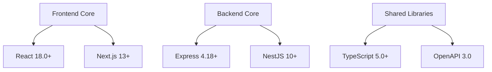
```mermaid
graph TD
    A[Frontend Core] --> B[React 18.0+]
    A --> C[Next.js 13+]
    
    D[Backend Core] --> E[Express 4.18+]
    D --> F[NestJS 10+]
    
    G[Shared Libraries] --> H[TypeScript 5.0+]
    G --> I[OpenAPI 3.0]
```

| Framework | Version | Purpose | Justification |
|-----------|---------|---------|---------------|
| React | 18.0+ | Frontend UI | - Server components support<br>- Concurrent rendering<br>- Large ecosystem |
| Next.js | 13+ | Frontend Framework | - SSR capabilities<br>- API routes<br>- Optimized builds |
| Express | 4.18+ | API Framework | - Minimal overhead<br>- Extensive middleware<br>- Easy scaling |
| NestJS | 10+ | Backend Framework | - TypeScript-first<br>- Modular architecture<br>- Enterprise patterns |

### Supporting Libraries

| Category | Library | Version | Purpose |
|----------|---------|---------|---------|
| State Management | Redux Toolkit | 1.9+ | Global state management |
| UI Components | Material UI | 5.0+ | Enterprise UI components |
| API Client | Axios | 1.4+ | HTTP client |
| Validation | Zod | 3.0+ | Runtime type checking |
| Testing | Jest/React Testing Library | 29+/14+ | Unit/Integration testing |
| Documentation | Swagger UI | 5.0+ | API documentation |

## 4.3 DATABASES & STORAGE

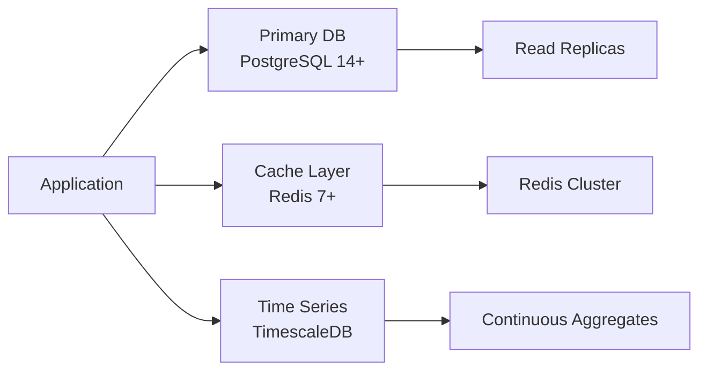
```mermaid
graph LR
    A[Application] --> B[Primary DB<br>PostgreSQL 14+]
    A --> C[Cache Layer<br>Redis 7+]
    A --> D[Time Series<br>TimescaleDB]
    
    B --> E[Read Replicas]
    C --> F[Redis Cluster]
    D --> G[Continuous Aggregates]
```

| Type | Technology | Version | Purpose |
|------|------------|---------|---------|
| Primary Database | PostgreSQL | 14+ | - Multi-tenant data storage<br>- ACID compliance<br>- JSON capabilities |
| Cache Layer | Redis | 7+ | - Real-time leaderboards<br>- Session management<br>- Distributed caching |
| Time Series | TimescaleDB | 2.9+ | - Activity history<br>- Performance metrics<br>- Analytical queries |
| Object Storage | Azure Blob Storage | Latest | - Badge images<br>- Report exports<br>- Backup storage |

## 4.4 THIRD-PARTY SERVICES

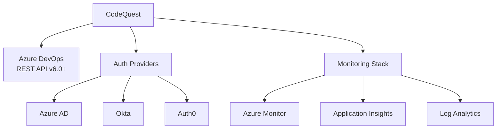
```mermaid
graph TD
    A[CodeQuest] --> B[Azure DevOps<br>REST API v6.0+]
    A --> C[Auth Providers]
    A --> D[Monitoring Stack]
    
    C --> E[Azure AD]
    C --> F[Okta]
    C --> G[Auth0]
    
    D --> H[Azure Monitor]
    D --> I[Application Insights]
    D --> J[Log Analytics]
```

| Service Type | Provider | Purpose | Integration Method |
|--------------|----------|---------|-------------------|
| Source Control | Azure DevOps | Activity tracking | REST API/Webhooks |
| Authentication | Multiple SSO | User authentication | SAML/OAuth/OIDC |
| Monitoring | Azure Monitor | System monitoring | SDK Integration |
| Analytics | Application Insights | Performance tracking | SDK Integration |
| Email | SendGrid | Notifications | REST API |

## 4.5 DEVELOPMENT & DEPLOYMENT

### Development Tools

| Category | Tool | Version | Purpose |
|----------|------|---------|---------|
| IDE | VS Code | Latest | Primary development |
| API Testing | Postman | Latest | Endpoint testing |
| Version Control | Git | 2.40+ | Source control |
| Package Manager | npm | 9+ | Dependency management |

### Deployment Pipeline

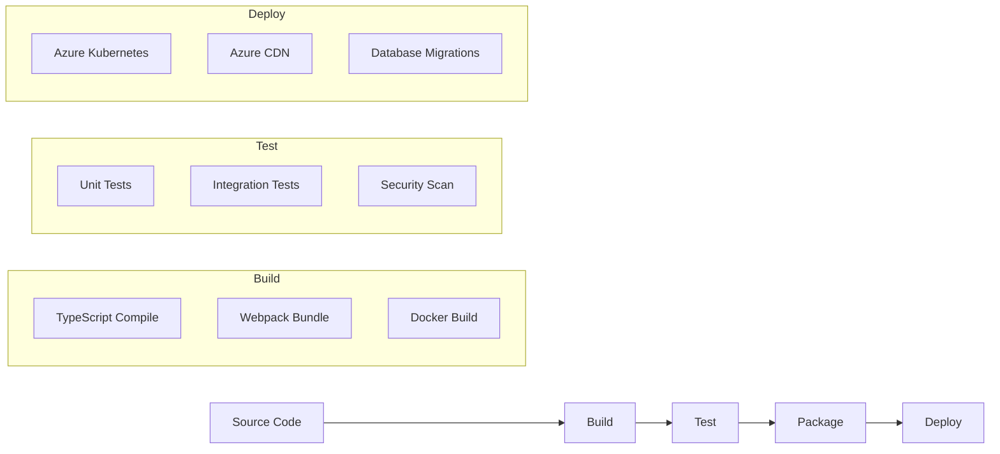
```mermaid
graph LR
    A[Source Code] --> B[Build]
    B --> C[Test]
    C --> D[Package]
    D --> E[Deploy]
    
    subgraph "Build"
    B1[TypeScript Compile]
    B2[Webpack Bundle]
    B3[Docker Build]
    end
    
    subgraph "Test"
    C1[Unit Tests]
    C2[Integration Tests]
    C3[Security Scan]
    end
    
    subgraph "Deploy"
    E1[Azure Kubernetes]
    E2[Azure CDN]
    E3[Database Migrations]
    end
```

| Stage | Technology | Configuration |
|-------|------------|---------------|
| Containerization | Docker | Multi-stage builds |
| Orchestration | Kubernetes | Azure AKS |
| CI/CD | Azure DevOps Pipelines | YAML-based |
| Infrastructure | Terraform | IaC |
| Monitoring | Azure Monitor | Auto-instrumentation |

# 5. SYSTEM DESIGN

## 5.1 USER INTERFACE DESIGN

### 5.1.1 Layout Structure

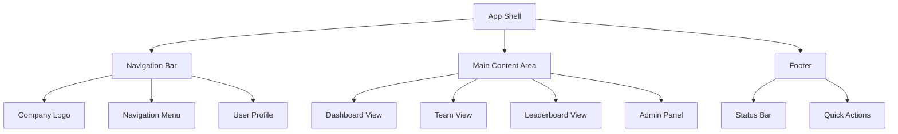
```mermaid
graph TD
    A[App Shell] --> B[Navigation Bar]
    A --> C[Main Content Area]
    A --> D[Footer]
    
    B --> B1[Company Logo]
    B --> B2[Navigation Menu]
    B --> B3[User Profile]
    
    C --> C1[Dashboard View]
    C --> C2[Team View]
    C --> C3[Leaderboard View]
    C --> C4[Admin Panel]
    
    D --> D1[Status Bar]
    D --> D2[Quick Actions]
```

### 5.1.2 Key Interface Components

| Component | Layout | Functionality |
|-----------|---------|---------------|
| Dashboard | Grid-based with cards | - Points summary<br>- Recent activities<br>- Achievement progress<br>- Team highlights |
| Leaderboard | Tabular with filters | - Sortable rankings<br>- Team/Individual toggle<br>- Time period filters<br>- Achievement badges |
| Team View | Split view with sidebar | - Member list<br>- Activity feed<br>- Performance metrics<br>- Point distribution |
| Admin Panel | Tab-based interface | - Organization settings<br>- Point configuration<br>- Team management<br>- Plugin setup |

### 5.1.3 Responsive Breakpoints

| Breakpoint | Width | Layout Adjustments |
|------------|-------|-------------------|
| Mobile | < 600px | Single column, stacked cards |
| Tablet | 600px - 1024px | Two columns, condensed navigation |
| Desktop | > 1024px | Full layout, expanded features |

## 5.2 DATABASE DESIGN

### 5.2.1 Schema Overview

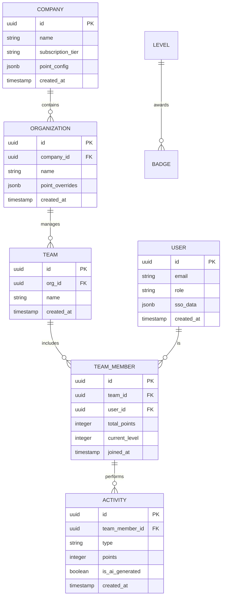
```mermaid
erDiagram
    COMPANY ||--o{ ORGANIZATION : contains
    ORGANIZATION ||--o{ TEAM : manages
    TEAM ||--o{ TEAM_MEMBER : includes
    USER ||--o{ TEAM_MEMBER : is
    TEAM_MEMBER ||--o{ ACTIVITY : performs
    LEVEL ||--o{ BADGE : awards
    
    COMPANY {
        uuid id PK
        string name
        string subscription_tier
        jsonb point_config
        timestamp created_at
    }
    
    ORGANIZATION {
        uuid id PK
        uuid company_id FK
        string name
        jsonb point_overrides
        timestamp created_at
    }
    
    TEAM {
        uuid id PK
        uuid org_id FK
        string name
        timestamp created_at
    }
    
    USER {
        uuid id PK
        string email
        string role
        jsonb sso_data
        timestamp created_at
    }
    
    TEAM_MEMBER {
        uuid id PK
        uuid team_id FK
        uuid user_id FK
        integer total_points
        integer current_level
        timestamp joined_at
    }
    
    ACTIVITY {
        uuid id PK
        uuid team_member_id FK
        string type
        integer points
        boolean is_ai_generated
        timestamp created_at
    }
```

### 5.2.2 Indexing Strategy

| Table | Index Type | Columns | Purpose |
|-------|------------|---------|---------|
| activity | B-tree | (team_member_id, created_at) | Activity timeline queries |
| team_member | B-tree | (team_id, total_points) | Leaderboard sorting |
| user | Hash | email | SSO lookups |
| organization | B-tree | company_id | Company filtering |

### 5.2.3 Partitioning Strategy

| Table | Partition Type | Key | Retention |
|-------|---------------|-----|-----------|
| activity | Time-based | created_at | 12 months |
| team_member | List | company_id | Permanent |
| user | Hash | id | Permanent |

## 5.3 API DESIGN

### 5.3.1 REST Endpoints

| Endpoint | Method | Purpose | Request/Response |
|----------|---------|---------|------------------|
| `/api/v1/activities` | POST | Record activity | Request: Activity details<br>Response: Activity ID |
| `/api/v1/points/{userId}` | GET | Get user points | Response: Point summary |
| `/api/v1/teams/{teamId}/leaderboard` | GET | Team rankings | Response: Ranked list |
| `/api/v1/organizations/{orgId}/config` | PUT | Update settings | Request: Config object |

### 5.3.2 WebSocket Events

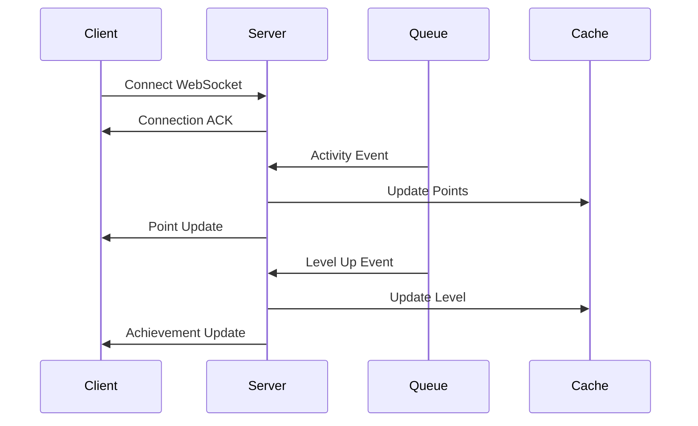
```mermaid
sequenceDiagram
    participant Client
    participant Server
    participant Queue
    participant Cache
    
    Client->>Server: Connect WebSocket
    Server->>Client: Connection ACK
    
    Queue->>Server: Activity Event
    Server->>Cache: Update Points
    Server->>Client: Point Update
    
    Queue->>Server: Level Up Event
    Server->>Cache: Update Level
    Server->>Client: Achievement Update
```

### 5.3.3 Integration Patterns

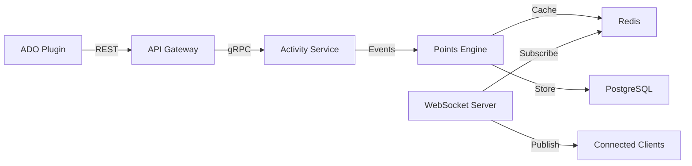
```mermaid
graph LR
    A[ADO Plugin] -->|REST| B[API Gateway]
    B -->|gRPC| C[Activity Service]
    C -->|Events| D[Points Engine]
    D -->|Cache| E[Redis]
    D -->|Store| F[PostgreSQL]
    
    G[WebSocket Server] -->|Subscribe| E
    G -->|Publish| H[Connected Clients]
```

### 5.3.4 API Security

| Layer | Implementation | Purpose |
|-------|---------------|---------|
| Authentication | JWT + OAuth2 | Identity verification |
| Authorization | RBAC | Access control |
| Rate Limiting | Token bucket | API protection |
| Input Validation | JSON Schema | Request validation |
| Output Encoding | Content-Type | Response security |

# 6. USER INTERFACE DESIGN

## 6.1 Common Components

### 6.1.1 Navigation Bar
```
+----------------------------------------------------------+
| CodeQuest [#]    Teams    Leaderboard    Points    [@]    |
+----------------------------------------------------------+
```

### 6.1.2 Standard Layout Structure
```
+----------------------------------------------------------+
| CodeQuest [#]    Teams    Leaderboard    Points    [@]    |
+----------------------------------------------------------+
|                                                           |
|  +------------------+  +---------------------------+      |
|  |  Left Sidebar    |  |  Main Content Area        |     |
|  |  [#] Dashboard   |  |                           |     |
|  |  [@] Profile     |  |                           |     |
|  |  [=] Settings    |  |                           |     |
|  |  [?] Help        |  |                           |     |
|  +------------------+  |                           |     |
|                       +---------------------------+      |
|                                                           |
+----------------------------------------------------------+
```

## 6.2 Developer Dashboard

### 6.2.1 Main Dashboard View
```
+----------------------------------------------------------+
| Welcome back, John Doe                     Level 12        |
+----------------------------------------------------------+
|                                                           |
|  +------------------+  +---------------------------+      |
|  | YOUR STATS       |  | RECENT ACTIVITIES         |     |
|  | Points: 2,450    |  | [Today]                   |     |
|  | [=========  ]90% |  | - Code Review (+15pts)    |     |
|  | Next: Level 13   |  | - Pull Request (+25pts)   |     |
|  |                  |  | - Bug Fix (+20pts)        |     |
|  | BADGES           |  |                           |     |
|  | [*] Code Master  |  | [Yesterday]               |     |
|  | [*] Bug Hunter   |  | - 2 Commits (+10pts)      |     |
|  | [*] Team Player  |  | - Code Review (+15pts)    |     |
|  +------------------+  +---------------------------+      |
|                                                           |
|  +--------------------------------------------------+   |
|  | TEAM LEADERBOARD                                  |   |
|  | 1. [@] Sarah M.    3,200 pts   [************]    |   |
|  | 2. [@] John D.     2,450 pts   [=========  ]     |   |
|  | 3. [@] Mike R.     2,100 pts   [=======   ]      |   |
|  +--------------------------------------------------+   |
+----------------------------------------------------------+
```

## 6.3 Admin Interface

### 6.3.1 Organization Management
```
+----------------------------------------------------------+
| Organization: TechCorp                [+] Add Team         |
+----------------------------------------------------------+
|  TEAMS                                                    |
|  +-- Frontend Team                                        |
|      |-- [@] Members (12)                                |
|      |-- Points Config [=]                               |
|      +-- Activity Log [i]                                |
|                                                           |
|  +-- Backend Team                                         |
|      |-- [@] Members (8)                                 |
|      |-- Points Config [=]                               |
|      +-- Activity Log [i]                                |
|                                                           |
|  POINT CONFIGURATION                                      |
|  +------------------------------------------------+      |
|  | Activity          | Points  | AI Detected       |      |
|  |------------------|---------|------------------|      |
|  | Code Review      | [...25] | [...15]         |      |
|  | Pull Request     | [...30] | [...20]         |      |
|  | Bug Fix          | [...20] | [...10]         |      |
|  | Commit           | [...10] | [...5]          |      |
|  +------------------------------------------------+      |
|  [Save Changes]                                          |
+----------------------------------------------------------+
```

### 6.3.2 Team Management
```
+----------------------------------------------------------+
| Frontend Team                        [+] Add Member        |
+----------------------------------------------------------+
|  MEMBERS                                                  |
|  +------------------------------------------------+      |
|  | Name          | Role      | Points    | Level   |      |
|  |---------------|-----------|-----------|---------|      |
|  | [@] John D.   | Lead      | 2,450     | 12      |      |
|  | [@] Sarah M.  | Senior    | 3,200     | 15      |      |
|  | [@] Mike R.   | Junior    | 2,100     | 11      |      |
|  +------------------------------------------------+      |
|                                                           |
|  ACHIEVEMENTS                                             |
|  +------------------------------------------------+      |
|  | Level | Name         | Points Required          |      |
|  |-------|--------------|------------------------|      |
|  | 1     | Rookie       | 0                      |      |
|  | 2     | Explorer     | 500                    |      |
|  | 3     | Developer    | 1000                   |      |
|  +------------------------------------------------+      |
+----------------------------------------------------------+
```

## 6.4 Component Key

### Navigation Icons
- [#] - Dashboard/Menu
- [@] - User Profile
- [=] - Settings
- [?] - Help/Information
- [i] - Information
- [+] - Add/Create
- [x] - Close/Delete
- [*] - Badge/Achievement

### Input Elements
- [...] - Text Input Field
- [ ] - Checkbox
- ( ) - Radio Button
- [v] - Dropdown Menu
- [Button] - Clickable Button
- [====] - Progress Bar

### Layout Elements
- +--+ - Container Border
- |  | - Vertical Border
- +-- - Tree View Structure
- --- - Table Border

### Interaction Notes
1. All navigation items are clickable
2. Progress bars show completion percentage
3. Tree views can be expanded/collapsed
4. Tables support sorting by column
5. Forms include validation
6. Modals use overlay for focus
7. Responsive design adapts to screen size
8. Real-time updates for points and activities

## 6.5 Responsive Behavior

### Mobile View
```
+----------------------+
| [=] CodeQuest    [@] |
+----------------------+
| Dashboard            |
|                      |
| YOUR STATS           |
| Points: 2,450        |
| [=========  ] 90%    |
| Level: 12            |
|                      |
| RECENT ACTIVITIES    |
| - Code Review (+15)  |
| - Pull Request (+25) |
|                      |
| TEAM LEADERBOARD     |
| 1. Sarah M.  3,200   |
| 2. John D.   2,450   |
+----------------------+
```

### Tablet View
```
+--------------------------------+
| [=] CodeQuest              [@] |
+--------------------------------+
|                                |
| +------------+ +------------+  |
| | STATS      | | ACTIVITIES |  |
| | Points:    | | Today      |  |
| | 2,450      | | - Review   |  |
| +------------+ +------------+  |
|                                |
| +----------------------------+ |
| | TEAM LEADERBOARD          | |
| | 1. Sarah M.    3,200      | |
| | 2. John D.     2,450      | |
| +----------------------------+ |
+--------------------------------+
```

# 7. SECURITY CONSIDERATIONS

## 7.1 AUTHENTICATION AND AUTHORIZATION

### 7.1.1 Authentication Flow

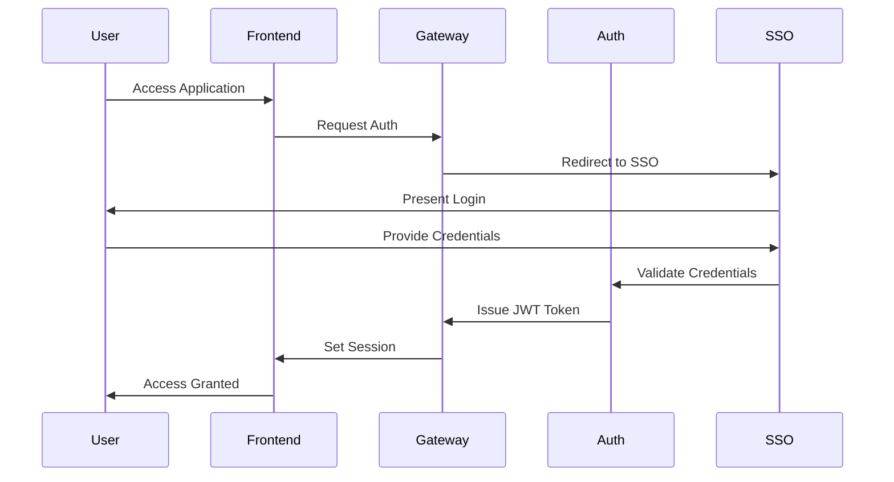
```mermaid
sequenceDiagram
    participant User
    participant Frontend
    participant Gateway
    participant Auth
    participant SSO

    User->>Frontend: Access Application
    Frontend->>Gateway: Request Auth
    Gateway->>SSO: Redirect to SSO
    SSO->>User: Present Login
    User->>SSO: Provide Credentials
    SSO->>Auth: Validate Credentials
    Auth->>Gateway: Issue JWT Token
    Gateway->>Frontend: Set Session
    Frontend->>User: Access Granted
```

### 7.1.2 Authorization Matrix

| Role | Company Management | Org Management | Team Access | Point Configuration | View Only |
|------|-------------------|----------------|-------------|-------------------|-----------|
| Super Admin | ✓ | ✓ | ✓ | ✓ | ✓ |
| Company Admin | ✓ | ✓ | ✓ | Company-wide | ✓ |
| Org Admin | - | Own Org | Own Org | Own Org | ✓ |
| Developer | - | - | Own Teams | - | ✓ |
| General User | - | - | - | - | ✓ |

### 7.1.3 Token Management

| Token Type | Lifetime | Refresh Strategy | Storage Location |
|------------|----------|------------------|------------------|
| Access JWT | 1 hour | Auto-refresh | Memory only |
| Refresh Token | 7 days | Re-authentication | HTTP-only cookie |
| SSO Token | Provider dependent | Provider flow | SSO context |
| API Token | 30 days | Manual rotation | Secure vault |

## 7.2 DATA SECURITY

### 7.2.1 Encryption Standards

```mermaid
flowchart TD
    A[Data Categories] --> B[Data at Rest]
    A --> C[Data in Transit]
    A --> D[Data in Use]
    
    B --> B1[AES-256-GCM]
    B --> B2[Database TDE]
    
    C --> C1[TLS 1.3]
    C --> C2[Perfect Forward Secrecy]
    
    D --> D1[Memory Encryption]
    D --> D2[Secure Compute]
```

### 7.2.2 Data Classification

| Data Type | Classification | Storage Requirements | Encryption Level |
|-----------|---------------|---------------------|------------------|
| User Credentials | Critical | Encrypted, Hashed | AES-256 + Argon2 |
| Activity Data | Sensitive | Encrypted | AES-256 |
| Points/Badges | Internal | Encrypted | AES-256 |
| Analytics | Internal | Encrypted | AES-256 |
| Public Content | Public | Standard Storage | TLS in transit |

### 7.2.3 Key Management

| Key Type | Rotation Period | Storage | Backup |
|----------|----------------|---------|---------|
| Database Keys | 90 days | Azure Key Vault | Geo-redundant |
| API Keys | 30 days | Azure Key Vault | Geo-redundant |
| SSL Certificates | 1 year | Azure Key Vault | Geo-redundant |
| Encryption Keys | 180 days | HSM | Geo-redundant |

## 7.3 SECURITY PROTOCOLS

### 7.3.1 Network Security

```mermaid
flowchart LR
    subgraph External
        A[Internet] --> B[WAF]
    end
    
    subgraph DMZ
        B --> C[Load Balancer]
        C --> D[API Gateway]
    end
    
    subgraph Internal
        D --> E[Application Servers]
        E --> F[Database]
        E --> G[Cache]
    end
```

### 7.3.2 Security Controls

| Control Type | Implementation | Purpose |
|--------------|----------------|----------|
| WAF | Azure Front Door | DDoS protection, threat detection |
| Rate Limiting | Token bucket algorithm | Prevent abuse |
| IP Filtering | Geolocation-based | Access control |
| Input Validation | JSON Schema | Prevent injection |
| Output Encoding | Content-Type enforcement | XSS prevention |
| CORS | Strict origin policy | Cross-origin protection |

### 7.3.3 Security Monitoring

| Component | Monitoring Type | Alert Threshold |
|-----------|----------------|-----------------|
| Failed Logins | Real-time | >5 in 5 minutes |
| API Usage | Real-time | >1000 req/min |
| Data Access | Real-time | Unauthorized attempts |
| System Changes | Real-time | Any critical change |
| Security Scans | Daily | Any vulnerability |

### 7.3.4 Compliance Requirements

| Requirement | Standard | Implementation |
|-------------|----------|----------------|
| Data Privacy | GDPR | Data minimization, consent |
| Access Control | ISO 27001 | RBAC, MFA |
| Audit Logging | SOC 2 | Comprehensive logging |
| Data Retention | Company Policy | Configurable retention |
| Incident Response | NIST | Documented procedures |

### 7.3.5 Security Testing

| Test Type | Frequency | Coverage |
|-----------|-----------|----------|
| Penetration Testing | Quarterly | External interfaces |
| Vulnerability Scanning | Weekly | All components |
| Security Reviews | Monthly | Code changes |
| Access Audits | Monthly | User permissions |
| Dependency Checks | Daily | All packages |

# 8. INFRASTRUCTURE

## 8.1 DEPLOYMENT ENVIRONMENT

```mermaid
flowchart TD
    subgraph Production
        A[Azure Cloud] --> B[Primary Region]
        A --> C[Secondary Region]
        B --> D[AKS Cluster]
        C --> E[Failover AKS Cluster]
    end
    
    subgraph Staging
        F[Azure Cloud] --> G[Staging Environment]
        G --> H[AKS Cluster]
    end
    
    subgraph Development
        I[Azure Cloud] --> J[Dev Environment]
        J --> K[AKS Cluster]
    end
```

| Environment | Purpose | Configuration | Scaling |
|------------|---------|---------------|----------|
| Production | Live system serving customers | Multi-region active-passive | Horizontal auto-scaling |
| Staging | Pre-production testing | Single region | Manual scaling |
| Development | Development and testing | Single region | Minimal resources |
| DR Site | Business continuity | Secondary region | Warm standby |

## 8.2 CLOUD SERVICES

| Service | Purpose | Justification |
|---------|---------|---------------|
| Azure Kubernetes Service (AKS) | Container orchestration | - Native ADO integration<br>- Enterprise-grade security<br>- Automated scaling |
| Azure Database for PostgreSQL | Primary database | - Managed service<br>- Auto-scaling<br>- Built-in replication |
| Azure Cache for Redis | Caching layer | - High availability<br>- Enterprise clustering<br>- Sub-millisecond latency |
| Azure Front Door | Global load balancing | - WAF capabilities<br>- SSL termination<br>- DDoS protection |
| Azure Monitor | Monitoring and alerts | - Native AKS integration<br>- Application insights<br>- Log analytics |
| Azure Key Vault | Secret management | - Centralized key storage<br>- Certificate management<br>- HSM backing |

## 8.3 CONTAINERIZATION

```mermaid
graph TD
    subgraph Container Images
        A[Base Image] --> B[Node.js Runtime]
        B --> C[Application Layer]
        C --> D[Final Image]
    end
    
    subgraph Registry
        E[Azure Container Registry]
        D --> E
    end
    
    subgraph Deployment
        E --> F[AKS Cluster]
    end
```

| Component | Implementation | Configuration |
|-----------|---------------|---------------|
| Base Image | node:18-alpine | Minimal secure base |
| Container Runtime | containerd | Native AKS support |
| Registry | Azure Container Registry | Geo-replication enabled |
| Image Scanning | Microsoft Defender | Vulnerability scanning |
| Build Process | Multi-stage builds | Optimized image size |

## 8.4 ORCHESTRATION

```mermaid
flowchart LR
    subgraph AKS Cluster
        A[Ingress Controller] --> B[API Gateway]
        B --> C[Service Mesh]
        C --> D[Application Pods]
        D --> E[Persistent Storage]
    end
    
    subgraph Supporting Services
        F[Monitoring]
        G[Logging]
        H[Metrics]
    end
    
    D --> F
    D --> G
    D --> H
```

| Component | Technology | Purpose |
|-----------|------------|---------|
| Container Orchestration | AKS 1.25+ | Cluster management |
| Service Mesh | Istio | Service communication |
| Ingress Controller | NGINX | Load balancing |
| Pod Autoscaling | HPA | Resource-based scaling |
| Storage Classes | Azure Managed Disks | Persistent storage |

## 8.5 CI/CD PIPELINE

```mermaid
flowchart LR
    subgraph Source
        A[Git Repository] --> B[Branch Protection]
    end
    
    subgraph Build
        B --> C[Code Analysis]
        C --> D[Unit Tests]
        D --> E[Container Build]
    end
    
    subgraph Test
        E --> F[Integration Tests]
        F --> G[Security Scan]
    end
    
    subgraph Deploy
        G --> H[Staging Deploy]
        H --> I[Production Deploy]
    end
```

| Stage | Tools | Actions |
|-------|-------|---------|
| Source Control | Azure DevOps Repos | - Branch policies<br>- Code review enforcement<br>- Automated merges |
| Build | Azure Pipelines | - Code compilation<br>- Unit testing<br>- Container builds |
| Test | Azure Test Plans | - Integration testing<br>- Security scanning<br>- Performance testing |
| Deploy | Azure Pipelines | - Blue-green deployment<br>- Canary releases<br>- Automated rollback |

### Pipeline Configuration

```yaml
trigger:
  - main
  - release/*

stages:
  - stage: Build
    jobs:
      - job: BuildAndTest
        steps:
          - task: NodeTool@0
          - task: Npm@1
          - task: Docker@2
          - task: PublishTestResults@2

  - stage: Deploy
    jobs:
      - deployment: DeployToAKS
        environment: production
        strategy:
          rolling:
            maxSurge: 25%
            maxUnavailable: 25%
```

# APPENDICES

## A.1 ADDITIONAL TECHNICAL INFORMATION

### A.1.1 Point Calculation Rules

```mermaid
flowchart TD
    A[Activity Detected] --> B{AI Generated?}
    B -->|Yes| C[Apply AI Modifier]
    B -->|No| D[Standard Points]
    C --> E[Base Points x 0.75]
    D --> F[Base Points x 1.0]
    E & F --> G[Apply Org Override]
    G --> H[Update User Total]
    H --> I[Check Level Up]
```

| Activity Type | Base Points | AI Modified Points | Notes |
|--------------|-------------|-------------------|--------|
| Code Check-in | 10 | 7.5 | Per commit |
| Pull Request | 25 | 18.75 | Per PR created |
| Code Review | 15 | 11.25 | Per review completed |
| Bug Fix | 20 | 15 | Per bug resolved |
| Story Closure | 30 | 22.5 | Per story completed |

### A.1.2 Database Partitioning Strategy

| Table | Partition Type | Key | Retention Policy |
|-------|---------------|-----|------------------|
| activities | Time-based | created_at | 12 months rolling |
| team_members | List | company_id | Permanent |
| points_history | Time-based | awarded_at | 24 months rolling |
| audit_logs | Time-based | timestamp | 36 months rolling |

## A.2 GLOSSARY

| Term | Definition |
|------|------------|
| Activity | Any trackable development action in Azure DevOps that earns points |
| AI Generated Code | Code detected as being produced by AI tools like GitHub Copilot |
| Base Points | Default point value for an activity before any modifiers |
| Company Default Points | Standard point values set at company level |
| Level Threshold | Point total required to achieve a specific level |
| Org Override | Custom point values configured at organization level |
| Point Modifier | Multiplier applied to base points (e.g., AI detection) |
| Real-time Update | Point allocation within 2 seconds of activity |
| Team Leaderboard | Ranking of team members by total points |
| Tenant Isolation | Separation of data between different companies |

## A.3 ACRONYMS

| Acronym | Full Form | Context |
|---------|-----------|---------|
| ADO | Azure DevOps | Development platform integration |
| API | Application Programming Interface | System integration interface |
| CDN | Content Delivery Network | Static asset delivery |
| CORS | Cross-Origin Resource Sharing | Security policy |
| CPU | Central Processing Unit | Resource monitoring |
| CRUD | Create, Read, Update, Delete | Database operations |
| DNS | Domain Name System | Network infrastructure |
| ELK | Elasticsearch, Logstash, Kibana | Log management stack |
| gRPC | Google Remote Procedure Call | Internal service communication |
| HSM | Hardware Security Module | Key management |
| IDE | Integrated Development Environment | Development tools |
| IaC | Infrastructure as Code | Deployment automation |
| JWT | JSON Web Token | Authentication mechanism |
| MFA | Multi-Factor Authentication | Security feature |
| OIDC | OpenID Connect | Authentication protocol |
| REST | Representational State Transfer | API architecture |
| RBAC | Role-Based Access Control | Authorization system |
| SAML | Security Assertion Markup Language | SSO protocol |
| SDK | Software Development Kit | Development tools |
| SQL | Structured Query Language | Database queries |
| SSO | Single Sign-On | Authentication method |
| SSL | Secure Sockets Layer | Security protocol |
| TDE | Transparent Data Encryption | Database security |
| TLS | Transport Layer Security | Communication security |
| URL | Uniform Resource Locator | Web addressing |
| UUID | Universally Unique Identifier | Unique ID format |
| WAF | Web Application Firewall | Security component |
| XML | Extensible Markup Language | Data format |