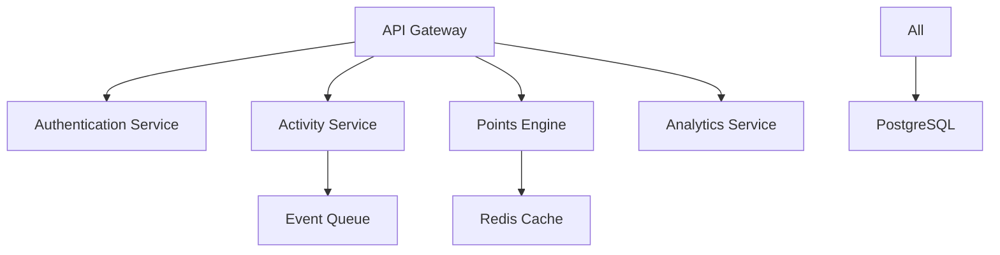

# CodeQuest Backend Service

Enterprise-grade gamification platform backend service built with NestJS, providing real-time points processing and seamless Azure DevOps integration.

## Architecture Overview

The CodeQuest backend is built on a scalable microservices architecture using:

- NestJS 10+ framework for robust REST APIs
- Event-driven activity processing with Redis pub/sub
- Multi-tenant data isolation with PostgreSQL 14+
- Real-time points calculation and caching system
- Service mesh integration with Istio
- Azure DevOps webhook integration

### System Components



## Prerequisites

- Node.js 18 LTS
- npm 9+
- PostgreSQL 14+
- Redis 7+ Cluster
- Docker 24+
- Kubernetes 1.25+
- Azure CLI 2.50+
- Azure DevOps access

## Getting Started

1. Clone the repository:
```bash
git clone https://github.com/your-org/codequest.git
cd codequest/backend
```

2. Install dependencies:
```bash
npm install
```

3. Configure environment:
```bash
cp .env.example .env
# Edit .env with your configuration
```

4. Start development server:
```bash
npm run start:dev
```

## Development Guide

### Project Structure
```
src/
├── config/         # Configuration files
├── modules/        # Feature modules
├── common/         # Shared utilities
├── database/       # Database migrations
├── dto/           # Data transfer objects
└── main.ts        # Application entry point
```

### Available Scripts

- `npm run start:dev` - Start development server
- `npm run build` - Build production bundle
- `npm run test` - Run unit tests
- `npm run test:e2e` - Run E2E tests
- `npm run lint` - Lint codebase
- `npm run format` - Format code
- `npm run migration:run` - Run database migrations
- `npm run docs:generate` - Generate API documentation

## API Documentation

API documentation is available at `/api/docs` when running the server. Built with Swagger/OpenAPI 3.0.

### Key Endpoints

- `/api/v1/activities` - Activity tracking
- `/api/v1/points` - Points management
- `/api/v1/teams` - Team operations
- `/api/v1/analytics` - Analytics queries

## Testing Strategy

### Unit Tests
```bash
npm run test
```

### Integration Tests
```bash
npm run test:e2e
```

### Load Tests
```bash
npm run test:load
```

## Deployment Guide

### Docker Build
```bash
docker build -t codequest-backend .
```

### Kubernetes Deployment
```bash
kubectl apply -f k8s/
```

### Database Migrations
```bash
npm run migration:run
```

## Monitoring and Maintenance

### Health Checks

- `/health` - Service health status
- `/metrics` - Prometheus metrics
- `/status` - Application status

### Logging

- Application logs: Azure Application Insights
- Audit logs: Azure Log Analytics
- Performance metrics: Azure Monitor

## Security Considerations

- JWT-based authentication
- Role-based access control (RBAC)
- Data encryption at rest and in transit
- Rate limiting and request throttling
- Regular security scanning
- Audit logging

## Contributing Guidelines

1. Fork the repository
2. Create a feature branch
3. Commit your changes
4. Push to the branch
5. Create a Pull Request

### Code Style

- Follow NestJS best practices
- Use TypeScript strict mode
- Maintain 100% test coverage
- Document public APIs
- Follow conventional commits

## License

Copyright (c) 2023 CodeQuest. All rights reserved.

## Support

For support and questions, please contact:
- Email: support@codequest.com
- Documentation: https://docs.codequest.com
- Issue Tracker: https://github.com/your-org/codequest/issues